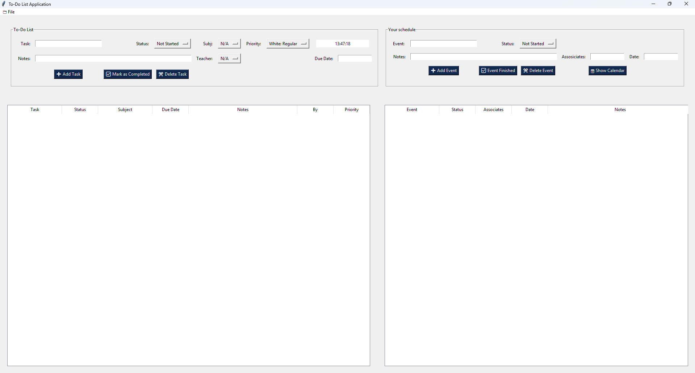

# Final Project | Basic Python Programming

## Project Details:

"My Notion" Planner is a **Graphical User Interface (GUI)** application for task and event scheduling, built entirely in **Python**.
The application uses the **Tkinter** module for the user interface and the built-in **JSON** and **OS** modules for local data storage and retrieval.

---

## Project Status:

| Detail | Value |
| :--- | :--- |
| **Tools** | GUI - Tkinter |
| **Current Version** | 1.0.1 |
| **Latest Edit** | September 19, 2025 |

---



---


## For Developers: Compiling to a Standalone (.EXE):

If you want to create a standalone executable (`.exe`) file for Windows, you can use the **PyInstaller** package.

**Note:** Since this is a GUI application, we use the `--windowed` flag to prevent the console window from opening when the program runs.

1.  **Install PyInstaller**
    * Open your command line (Terminal or Command Prompt) and run the installation command:
        ```bash
        pip install pyinstaller
        ```

2.  **Navigate to the Script Directory**
    * Change your directory to the folder containing the main script (assuming the filename is still **`GUI To-do List.py`**):
        ```bash
        cd path\to\your\script\folder
        ```

3.  **Compile the Executable**
    * Run the PyInstaller command:
        ```bash
        pyinstaller --onefile --windowed "GUI To-do List.py"
        ```

**Result:** The final executable, **`GUI To-do List.exe`**, will be generated in the **`dist`** folder within your script's directory.

---

## ⚠️ Deployment Note:

Please ensure you **remove** or replace all placeholder test accounts and credentials before deploying or sharing the application. 
However for only testing purpose | Username: Test_user / Password: 0123


