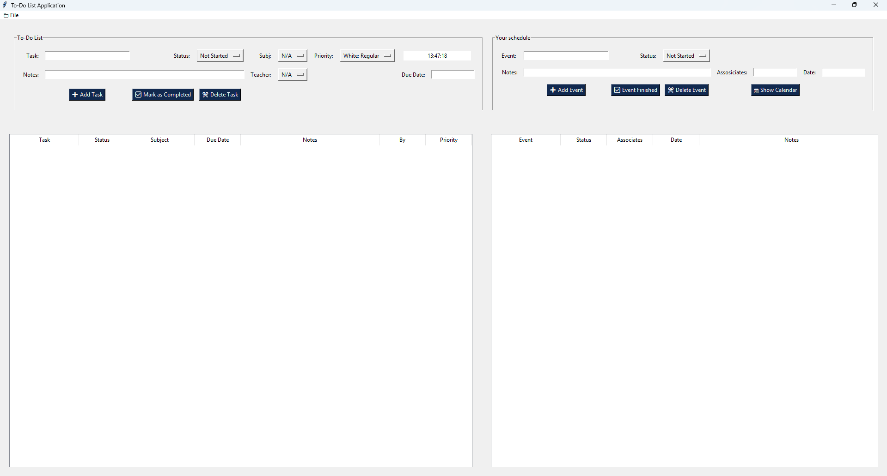

# Final Project | "My Notion" Study Planner

A **desktop GUI application** for task and event management, built entirely in Python as the capstone project for the Basic Python Programming course.

---

## Overview

"My Notion" Planner is a Tkinter-based study planner designed for students to organize homework, assignments, and personal events. It features dual management panels (To-Do List + Event Scheduler), a built-in calendar with date-aware task lookup, priority-based color coding, persistent JSON storage, and user authentication.

---

## Key Features

| Feature | Description |
| :--- | :--- |
| **User Authentication** | Login system with username/password validation and session management. |
| **To-Do List Manager** | Add tasks with subject, teacher, due date, notes, status, and priority level. |
| **Event Scheduler** | Separate panel for scheduling events with associates, dates, and notes. |
| **Priority Color Coding** | Tasks are highlighted in the tree view — 🔴 Red (Critical), 🟡 Yellow (Caution), ⚪ White (Regular). |
| **Built-in Calendar** | A pop-up calendar with month navigation. Clicking a date auto-fills the date field and displays all tasks/events due on that day. |
| **Mark as Completed** | One-click completion with a ✅ status update and timestamp confirmation. |
| **Persistent Storage** | All data saved/loaded as JSON files per user (`{username}_tasks_events.json`). |
| **Live Clock** | Real-time clock displayed in the task panel. |
| **Menu Bar** | File menu with Save (💾) and Exit (✂️) options. |

---

## UI Layout



The interface is split into two halves:
- **Left Panel — To-Do List:** Input fields for task name, status dropdown, subject dropdown (12 subjects), teacher dropdown (8 teachers), priority level, due date (with calendar picker), and notes. Below is a `Treeview` table displaying all tasks.
- **Right Panel — Event Schedule:** Input fields for event name, status, associates, date, and notes. Below is a `Treeview` table displaying all events.

---

## Subjects & Teachers Pre-loaded

**Subjects:** Python 101, Microcontroller, Mathematics, Physics for Engineering, General Science, English, Social Studies, Health Education, Physical Education, Art, Music, Thai

**Teachers:** Aj. Praphat, Aj. Tanapoom, T. Nas, Aj. Suwapat, T. Dan, Aj. Napasawan, Aj. Watchapol, T. Colin

---

## How It Was Built

- **Language:** Python 3
- **GUI Framework:** Tkinter (`tk`, `ttk`) — standard library, no external dependencies for the GUI itself.
- **Data Persistence:** JSON files using Python's built-in `json` and `os` modules. Each user gets their own file.
- **Calendar:** Custom `CalendarPopup` class extending `tk.Toplevel` using the `calendar` module for month rendering. Supports month navigation and date-aware task/event lookup.
- **Architecture:** Procedural with a single OOP component (`CalendarPopup`). Global state management for widget references. Login and main windows are separate `Tk()` instances.
- **Design Pattern:** Event-driven — all buttons, dropdowns, and date fields are wired to callback functions that modify the shared `Treeview` data store.

---

## How to Run

```bash
# Launch the application
python "GUI To-do List.py"
```

**Test Credentials:** Username: `Test_user` / Password: `0123`

---

## Compiling to Standalone (.EXE)

To distribute without requiring Python installed:

```bash
# 1. Install PyInstaller
pip install pyinstaller

# 2. Navigate to the script folder
cd path\to\Study_Planner_Program

# 3. Compile
pyinstaller --onefile --windowed "GUI To-do List.py"
```

The executable will be generated in the `dist/` folder.

---

## Project Info

| Detail | Value |
| :--- | :--- |
| **Version** | 1.0.1 |
| **Last Updated** | September 19, 2025 |
| **Presentation** | [View Slide on Canva](https://www.canva.com/design/DAGxtyG9tfc/K5777IxhW36veiXEsH30mQ/view?utm_content=DAGxtyG9tfc&utm_campaign=designshare&utm_medium=link2&utm_source=uniquelinks&utlId=hba0d3f8f84) |

---

## ⚠️ Deployment Note

Please **remove or replace** all placeholder test accounts and credentials before deploying or sharing the application publicly.
